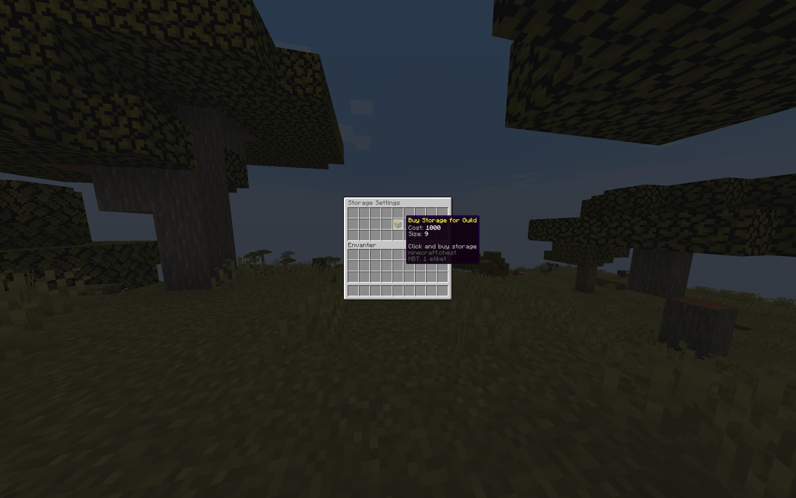

## Guild Storage Module

### What is it?

- The Guild Storage Module allows guild members to use a shared storage system. Players can securely store their items in the guild's shared storage.

### Features

- Set the usage fee for the guild storage.
- Create guild storage levels, set the storage size and fee (maximum 54 slots).
- Determine which players can withdraw items from the guild storage.

### Commands

#### Player Commands

- `/guildstorage` - Opens the guild storage.
- `/guildstorage upgrade` - Opens the purchase/upgrade menu for the guild storage.
- `/guildstorage rank <rank>` - Sets who can access the guild storage.

#### Admin Commands

- `/adminguild delete <name>` - Deletes the specified guild's storage.
- `/adminguild show <name>` - Opens the specified guild

**Images**

