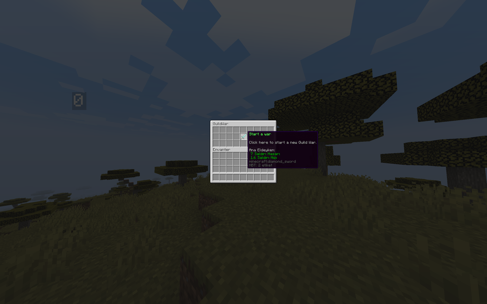
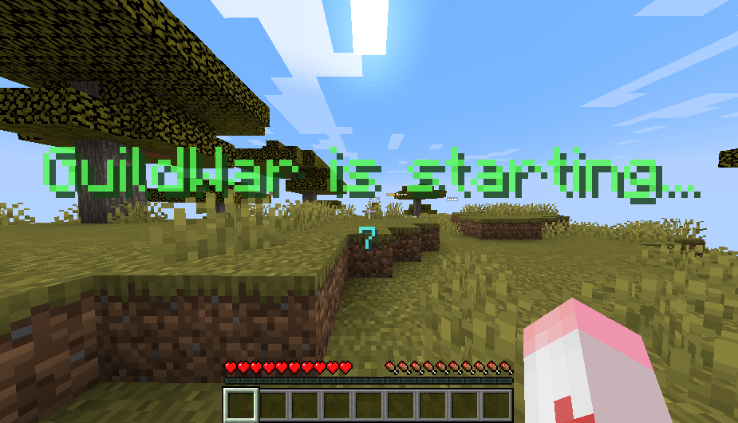

# GuildWar - Lonca Savaşı

## Nedir?

**GuildWar**, iki lonca arasında gerçekleşen heyecan verici bir arena savaşıdır. Bu sistem, lonca liderlerinin karşı karşıya gelerek loncalar arasındaki rekabeti artırmasını sağlar.

## Özellikler

- **Sınırsız Arena Oluşturma:** İhtiyaçlarınıza göre sınırsız sayıda arena oluşturabilirsiniz.
- **Özelleştirilebilir GUI:** Kullanıcı arayüzünü tamamen özelleştirebilirsiniz.
- **Komut Engelleyici:** Savaş sırasında belirli komutların kullanımını engeller.
- **Aşamalar:** Hazırlanma, Savaş, ve Bitiş aşamaları ile sistematik bir savaş deneyimi.
- **Glow Efekti:** Lonca savaşı sırasında düşman lonca oyuncuları kırmızı parlar.

## Komutlar

### Oyuncu Komutları

- `/guildwar` - Lonca savaşı için gerekli menüyü açar.
- `/guildwar join` - Lonca savaşı başladıktan sonra oyuncuların savaşa katılmasını sağlar.
- `/guildwar accept <name>` - Gelen bir daveti kabul eder.

### Admin Komutları

- `/adminguildwar setspawn` - Oyuncuların savaş sonunda dönecekleri yeri ayarlar.
- `/adminguildwar setarenaspawn <arena_id> <attacker/victim>` - Bir arena oluşturur ve spawn noktalarını ayarlar.

## PlaceholderAPI

- `%rguilds_war_point%` - Oyuncunun bağlı olduğu loncadaki savaş kazanma skorunu gösterir.

## Görseller

