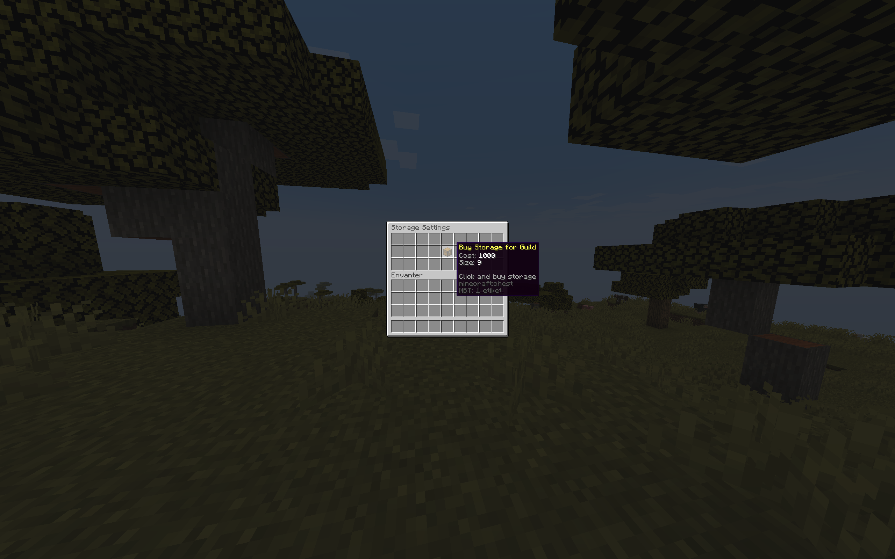
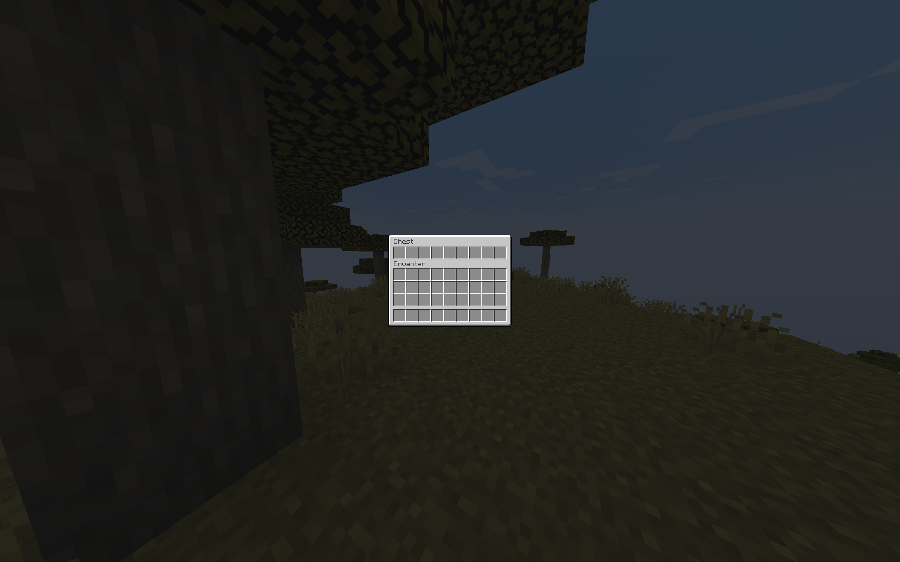
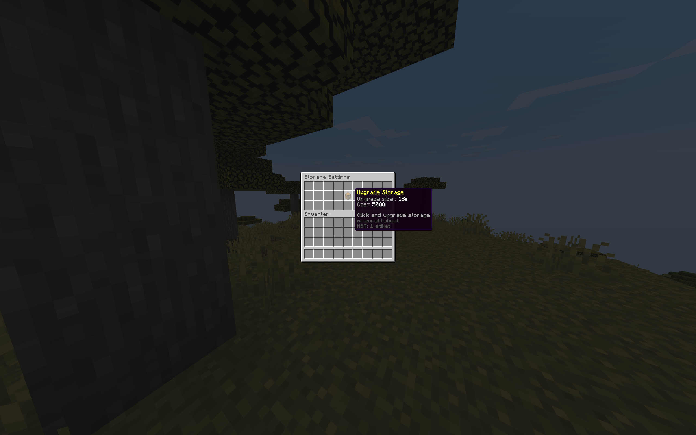

## Lonca Deposu Modülü

### Nedir?

- Lonca deposu modülü, lonca üyelerinin ortak bir depo kullanabileceği bir sistemdir. Oyuncular, eşyalarını loncanın ortak deposunda güvenle saklayabilirler.

### Özellikler

- Lonca deposunun kullanım ücretini ayarlama.
- Lonca depo seviyesi oluşturma, genişliğini ve ücretini ayarlama (maksimum 54 slot).
- Hangi oyuncuların lonca deposundan eşya alabileceğini belirleme.

### Komutlar

#### Oyuncu Komutları

- `/guildstorage` - Lonca deposunu açar.
- `/guildstorage upgrade` - Lonca deposunu satın alma veya yükseltme menüsünü açar.
- `/guildstorage rank <rütbe>` - Lonca deposuna kimlerin erişebileceğini ayarlar.

#### Admin Komutları

- `/adminguild delete <isim>` - Belirtilen loncanın deposunu siler.
- `/adminguild show <isim>` - Belirtilen loncanın deposunu açar.

### Görseller

