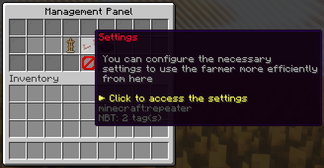
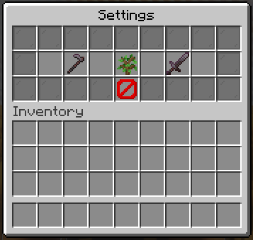
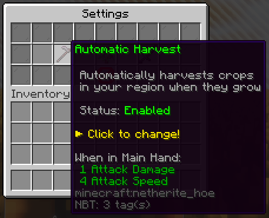
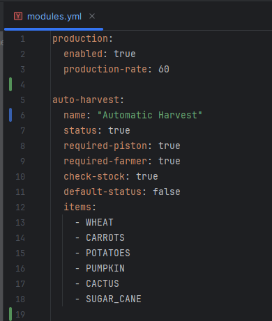
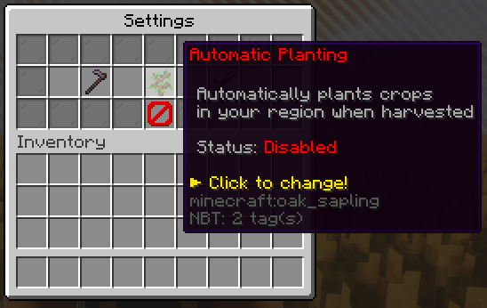
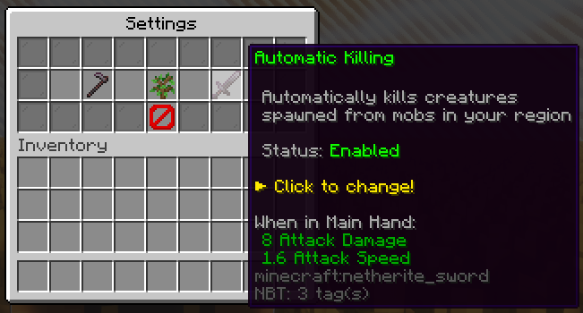

**required-piston:** required-piston seçeneğini false olarak ayarlarsanız, oyuncuların otomatik hasat için bir piston yerleştirmesi gerekmez.

**required-farmer:** required-farmer seçeneğini false olarak ayarlarsanız, hiç çiftçinin olmadığı bölgelerde bile ürünler hasat edilir.

**check-stock:** check-stock seçeneğini false olarak ayarlarsanız, çiftçinin deposu dolu olsa bile ürünler hasat edilecek ve droplar yere düşecektir.

